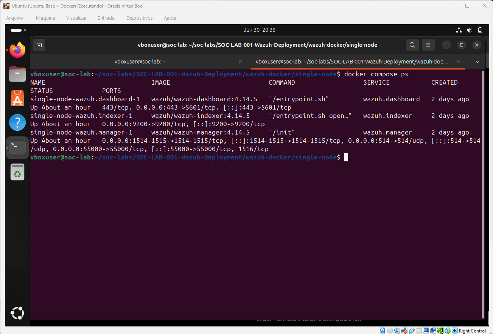
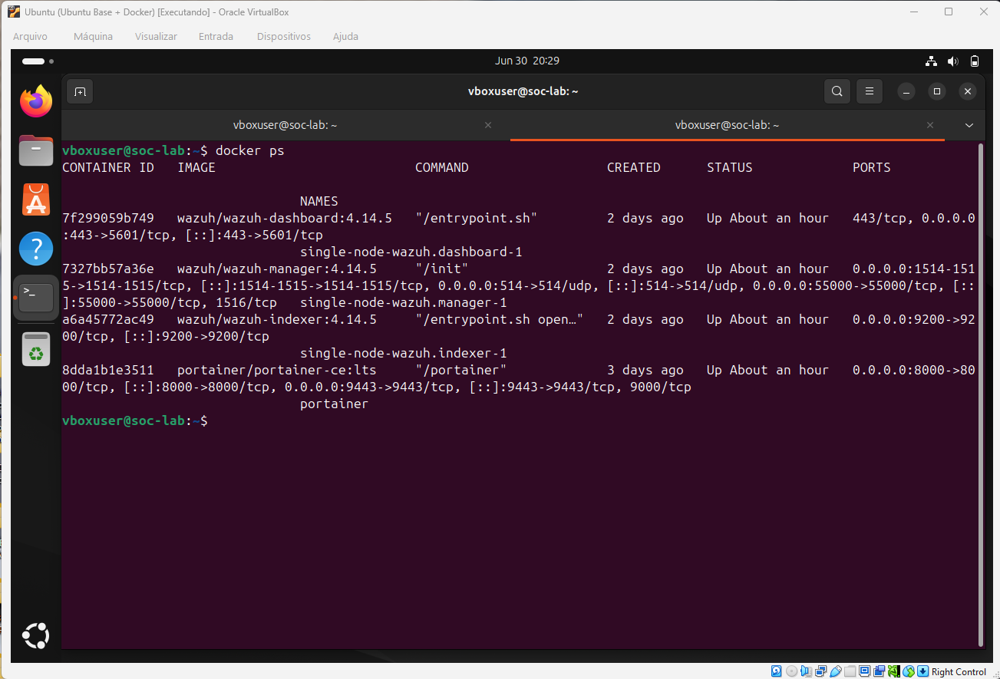
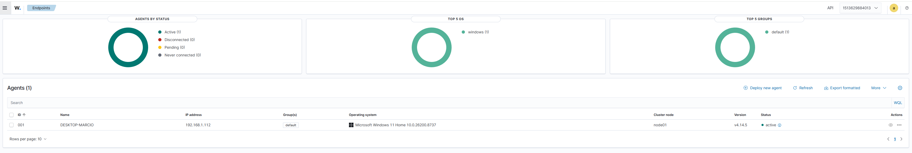
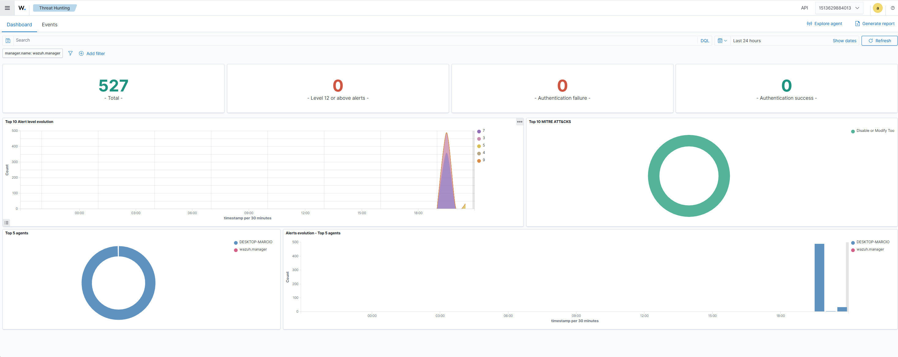

# 🛡️ SOC-LAB-001 - Wazuh Deployment

> Deploying a complete Wazuh SIEM environment using Docker Compose, enrolling a Windows 11 endpoint, and validating centralized security event collection through the Threat Hunting module.

---

# 📌 Overview

This project demonstrates the deployment of a complete Wazuh SIEM environment using Docker Compose on Ubuntu Linux.

The lab includes:

- Wazuh Manager deployment
- Wazuh Indexer deployment
- Wazuh Dashboard deployment
- Windows 11 Agent enrollment
- Threat Hunting validation
- Environment troubleshooting
- Documentation of the deployment process

---

# 🎯 Objective

Deploy a complete Wazuh SIEM environment using Docker Compose, enroll a Windows endpoint and validate centralized event collection through the Threat Hunting module.

---

# 🏗️ Lab Architecture

```text
                Windows 11
               Wazuh Agent
                    │
                    │
                    ▼
          +------------------+
          |  Wazuh Manager   |
          +------------------+
                    │
                    ▼
          +------------------+
          | Wazuh Indexer    |
          +------------------+
                    │
                    ▼
          +------------------+
          | Wazuh Dashboard  |
          +------------------+
```

---

# 🛠️ Technologies Used

| Technology | Purpose |
|------------|---------|
| Ubuntu Linux | Host Operating System |
| Docker | Container Platform |
| Docker Compose | Service Orchestration |
| Wazuh Manager | Event Processing |
| Wazuh Indexer | Event Storage |
| Wazuh Dashboard | Visualization |
| Windows 11 | Endpoint |
| Wazuh Agent | Log Collection |

---

# 🚀 Environment Validation

The deployment was validated by confirming that all Wazuh services were running correctly inside Docker containers.

---

## Docker Containers



### Evidence

The screenshot confirms that all services are running successfully, including:

- Wazuh Dashboard
- Wazuh Manager
- Wazuh Indexer
- Portainer

---

## Docker Compose Status



### Evidence

The command below confirms that every service defined in the Docker Compose file is operational.

```bash
docker compose ps
```

---

# 💻 Windows Endpoint Enrollment

After deploying the SIEM platform, a Windows 11 endpoint was successfully enrolled into the Wazuh Manager.

## Active Agent

> IP address intentionally hidden for security reasons.



The endpoint **DESKTOP-MARCIO** successfully connected to the manager and its status changed to **Active**.

---

# 🔎 Threat Hunting Validation

The Threat Hunting module was used to validate centralized log collection.



The dashboard confirms that security events generated by the Windows endpoint are being successfully indexed and visualized.

---

# ⚠️ Troubleshooting

## Docker Compose Error

### Problem

```text
docker compose ps
```

returned

```text
no configuration file provided: not found
```

### Cause

The command was executed outside the directory containing the `docker-compose.yml` file.

### Solution

Navigate to the correct directory before executing Docker Compose commands.

---

## Invalid Wazuh Download

### Problem

An HTML page was downloaded instead of the installation package.

### Cause

Incorrect repository URL.

### Solution

Download the project directly from the official Wazuh repository.

---

## Slow Initial Startup

### Cause

During the first startup Docker creates certificates, indexes and initializes OpenSearch.

### Solution

Wait until all containers become healthy before accessing the dashboard.

---

# ✅ Validation Checklist

| Validation | Status |
|------------|--------|
| Docker Installed | ✅ |
| Docker Compose | ✅ |
| Wazuh Manager | ✅ |
| Wazuh Indexer | ✅ |
| Wazuh Dashboard | ✅ |
| Windows Agent | ✅ |
| Threat Hunting | ✅ |

---

# 🎓 Skills Demonstrated

- Linux Administration
- Docker
- Docker Compose
- Wazuh Deployment
- SIEM Administration
- Endpoint Enrollment
- Threat Hunting
- Troubleshooting
- Technical Documentation

---

# 📚 Learning Outcomes

After completing this lab I was able to:

- Deploy Wazuh using Docker Compose
- Generate TLS certificates
- Configure a complete SIEM environment
- Enroll Windows endpoints
- Validate agent communication
- Verify event ingestion
- Perform troubleshooting on Docker deployments

---

# 🏁 Conclusion

This laboratory successfully demonstrates the deployment and validation of a complete Wazuh SIEM environment using Docker Compose.

The following objectives were achieved:

- Successful container deployment
- Secure communication between services
- Windows endpoint enrollment
- Active agent communication
- Centralized event collection
- Threat Hunting validation

The environment is now ready for advanced SOC labs involving Detection Engineering, Sysmon integration, Incident Response and Threat Hunting.

---

# 🚀 Next Labs

- SOC-LAB-002 — Wazuh Dashboard Navigation
- SOC-LAB-003 — Sysmon Integration
- SOC-LAB-004 — PowerShell Detection
- SOC-LAB-005 — Windows Authentication Events
- SOC-LAB-006 — Threat Hunting
- SOC-LAB-007 — Incident Response

---

# 📖 References

- Wazuh Official Documentation
- Docker Documentation
- Docker Compose Documentation

---

## 👨‍💻 Author

**Marcio Braga**

Cybersecurity Student | SOC Analyst (Junior Path) | Blue Team | Wazuh SIEM

