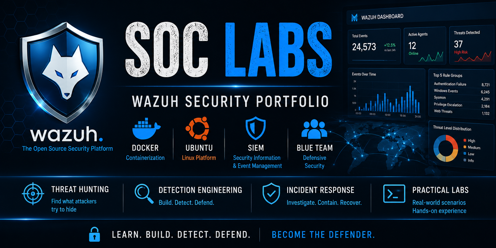
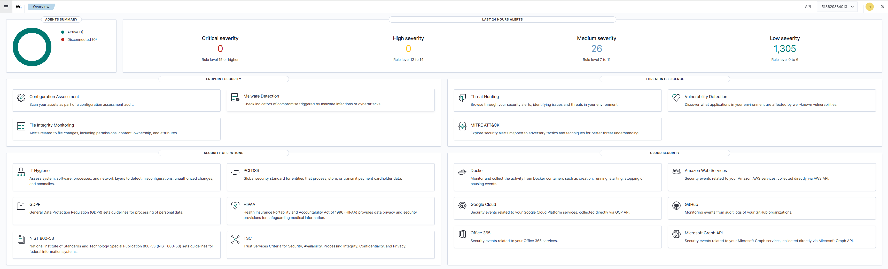
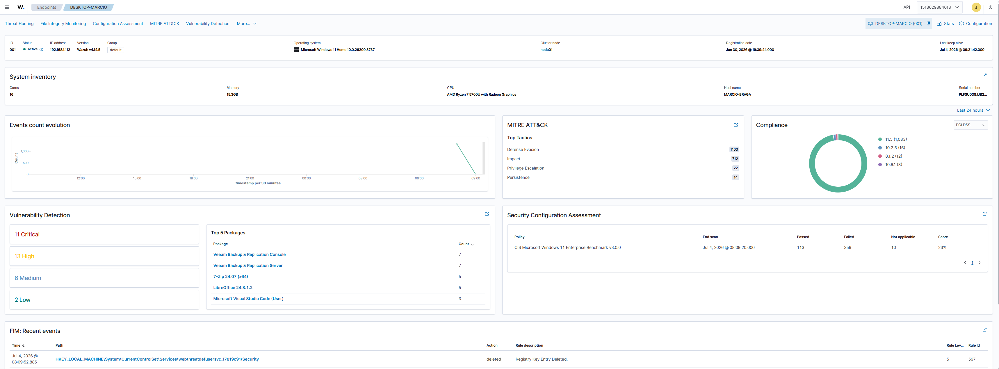
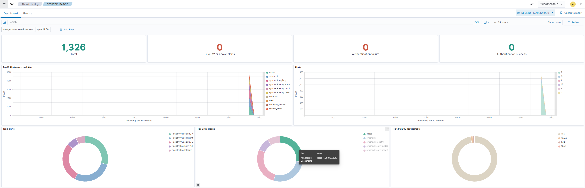
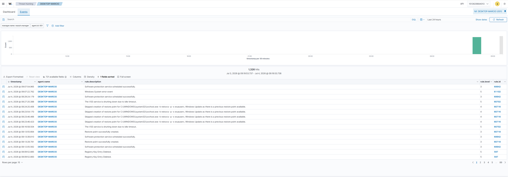
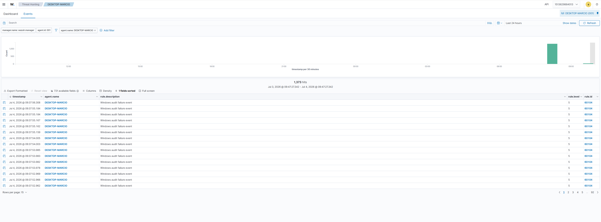
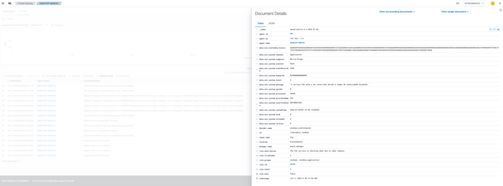
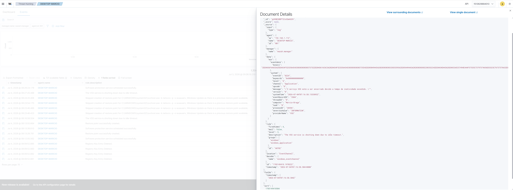

  

# 🛡️ SOC-LAB-002 – Wazuh Dashboard Navigation & Event Investigation

> Learning how to navigate the Wazuh Dashboard, investigate security events and analyze event details using the Threat Hunting module.

---

# 📌 Overview

This laboratory focuses on the operational use of the Wazuh Dashboard after the successful deployment completed in SOC-LAB-001.

The objective is to understand how security analysts navigate the platform, investigate events, filter security logs and inspect event details.

---

# 🎯 Objective

Develop practical skills in navigating the Wazuh Dashboard and performing basic event investigations using the Threat Hunting module.

---

# 🏗️ Dashboard Components

During this lab the following Wazuh modules were explored:

- Dashboard Overview
- Endpoint Summary
- Threat Hunting Dashboard
- Events
- Search & Filters
- Document Details (Table)
- Document Details (JSON)

---

# 🛠️ Technologies Used

| Technology | Purpose |
|------------|---------|
| Wazuh Dashboard | Security Monitoring |
| Wazuh Manager | Event Processing |
| Wazuh Agent | Endpoint Monitoring |
| Windows 11 | Monitored Endpoint |
| Docker | Wazuh Deployment |
| Ubuntu Linux | Host Operating System |

---

# 📊 Dashboard Overview

### Evidence

The Dashboard provides a high-level overview of the monitored environment, including active agents, alert severity distribution and available security modules.

---

# 💻 Endpoint Summary

### Evidence

The Endpoint Summary displays detailed information about the monitored Windows endpoint, including inventory, compliance, vulnerabilities, MITRE ATT&CK mapping and security posture.

---

# 🔎 Threat Hunting Dashboard

### Evidence

The Threat Hunting dashboard provides visibility into alert trends, event severity and rule groups, allowing analysts to quickly assess security activity.

---

# 📑 Events View

### Evidence

The Events page lists every security event collected by the Wazuh platform.

Each event includes:

- Timestamp
- Rule ID
- Rule Level
- Agent
- Description

This view represents the primary investigation interface used by SOC analysts.

---

# 🔍 Search & Filters

### Evidence

Security analysts rarely inspect every event individually.

Instead, filters are applied to quickly locate relevant information.

Examples explored during this lab:

- Filter by Agent Name
- Filter by Rule Level
- Filter by Rule ID
- Filter by Rule Description

---

# 📄 Event Details (Table)

### Evidence

Selecting an event opens the structured Table view, where analysts can inspect:

- Agent
- Manager
- Rule ID
- Rule Level
- Decoder
- Event ID
- Timestamp
- Description

---

# 🧾 Event Details (JSON)

### Evidence

The JSON view exposes the complete raw event collected by Wazuh.

Important fields analyzed during this laboratory:

| Field | Description |
|--------|-------------|
| agent | Endpoint that generated the event |
| manager | Wazuh Manager |
| eventID | Native Windows Event ID |
| rule.id | Wazuh Detection Rule |
| rule.level | Alert Severity |
| decoder | Parser used by Wazuh |
| message | Original Windows Event |
| timestamp | Event Time |

The JSON view is one of the most valuable resources during security investigations.

---

# ⚠️ Investigation Example

During this laboratory, Windows Security Event **5061** was analyzed.

Key observations:

- Cryptographic Operation
- User: **yukem**
- Provider: Microsoft Software Key Storage Provider
- Rule ID: **60104**
- Rule Level: **5**
- Severity: **AUDIT_FAILURE**

The analysis demonstrated how raw Windows events are normalized and enriched by Wazuh before becoming searchable security alerts.

---

# ✅ Validation Checklist

| Validation | Status |
|------------|--------|
| Dashboard Accessible | ✅ |
| Endpoint Connected | ✅ |
| Threat Hunting Operational | ✅ |
| Events Collected | ✅ |
| Search Filters Working | ✅ |
| Event Details Accessible | ✅ |
| JSON Analysis Completed | ✅ |

---

# 🎓 Skills Demonstrated

- Wazuh Dashboard Navigation
- Event Investigation
- Security Monitoring
- Threat Hunting
- Endpoint Analysis
- Event Filtering
- Windows Event Analysis
- JSON Log Analysis
- Technical Documentation

---

# 📚 Learning Outcomes

After completing this laboratory I was able to:

- Navigate the Wazuh Dashboard
- Locate monitored endpoints
- Investigate security events
- Apply search filters
- Interpret Windows security events
- Analyze event details using Table and JSON views
- Understand how Wazuh enriches native Windows logs

---

# 🏁 Conclusion

This laboratory demonstrated the daily workflow of a SOC Analyst using the Wazuh Dashboard.

The environment was successfully validated by navigating security modules, filtering events and inspecting both structured and raw event data.

These activities represent the first steps of security event investigation within a Security Operations Center (SOC).

---

# 🚀 Next Labs

- SOC-LAB-003 – Sysmon Integration
- SOC-LAB-004 – PowerShell Detection
- SOC-LAB-005 – Windows Authentication Events
- SOC-LAB-006 – Threat Hunting
- SOC-LAB-007 – Incident Response

---

# 📖 References

- Wazuh Official Documentation
- Windows Security Auditing Documentation
- Docker Documentation

---

## 👨‍💻 Author

**Marcio Braga**

Cybersecurity Student • SOC Analyst (Junior Path) • Blue Team • Wazuh SIEM
