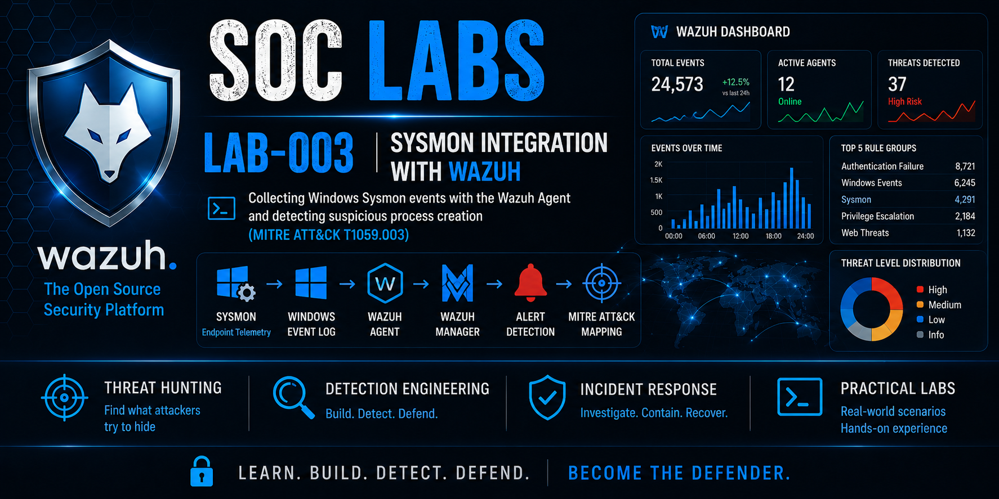

<p align="center">
  
</p>

# LAB-003 – Sysmon Integration with Wazuh

Collecting Windows Sysmon events with the Wazuh Agent
and detecting suspicious process creation
(MITRE ATT&CK T1059.003)

## Overview

This lab demonstrates how to integrate Microsoft Sysmon with the Wazuh SIEM platform to improve Windows endpoint visibility and threat detection.

Sysmon provides detailed telemetry about process creation, network connections, file creation, registry modifications, and other system activities. Wazuh collects these events, decodes them, applies detection rules, and maps them to the MITRE ATT&CK framework.

---

## Objectives

- Install Microsoft Sysmon
- Configure Sysmon with a community security configuration
- Configure the Wazuh Agent to collect Sysmon logs
- Validate event collection
- Trigger a Process Create event
- Analyze the generated alert in Wazuh
- Identify the corresponding MITRE ATT&CK technique

---

## Lab Environment

| Component | Version |
|-----------|---------|
| Windows 11 | Client |
| Ubuntu Server | VirtualBox |
| Docker | Latest |
| Wazuh | 4.14.5 |
| Sysmon | 15.21 |

---

## Architecture

```
Windows Endpoint
        │
        │
    Sysmon
        │
        │
Windows Event Log
        │
        │
Wazuh Agent
        │
        │
Wazuh Manager
        │
        │
Alert Decoder
        │
        │
Detection Rule
        │
        │
MITRE ATT&CK Mapping
```

---

# Step 1 – Verify Sysmon Status

Initially, Sysmon was not installed on the endpoint.


---

# Step 2 – Install Sysmon

Sysmon was installed using the SwiftOnSecurity configuration file.

The installation completed successfully and Windows immediately started generating Sysmon Event ID 1 (Process Creation) events.


---

# Step 3 – Configure Wazuh Agent

The Wazuh Agent was configured to collect the Sysmon Operational log.

```xml
<localfile>
    <location>Microsoft-Windows-Sysmon/Operational</location>
    <log_format>eventchannel</log_format>
</localfile>
```

After editing the configuration, the Wazuh Agent service was restarted.


---

# Step 4 – Detection Evidence

After generating a Process Create event, Wazuh successfully received and decoded the Sysmon event.

The JSON output contains:

- Agent information
- Process name
- Parent process
- Command line
- User
- SHA256 hash
- Process GUID
- Timestamp


---

# Step 5 – Detection Analysis

Wazuh analyzed the Sysmon event and triggered Detection Rule **92052**.

Detection Details:

- Rule ID: **92052**
- Severity: **4**
- Description:
  - Windows command prompt started by an abnormal process

MITRE ATT&CK Mapping:

| Tactic | Technique | ID |
|---------|-----------|----|
| Execution | Windows Command Shell | T1059.003 |


---

# Detection Summary

| Field | Value |
|--------|-------|
| Event Source | Sysmon |
| Event ID | 1 |
| Process | cmd.exe |
| Parent Process | chrome.exe |
| User | Marcio-Braga\\yukem |
| Detection Rule | 92052 |
| Severity | 4 |
| MITRE ATT&CK | T1059.003 |
| Decoder | windows_eventchannel |

---


# Skills Demonstrated

- Microsoft Sysmon Deployment
- Windows Event Monitoring
- Endpoint Telemetry Collection
- Wazuh Agent Configuration
- Windows Event Log Collection
- Event Decoding and Parsing
- Wazuh Rule Analysis
- Threat Detection
- SIEM Investigation
- MITRE ATT&CK Mapping
- Security Monitoring

---

# Key Takeaways

This lab demonstrates the successful integration of Microsoft Sysmon with the Wazuh SIEM platform.

The Windows endpoint generated detailed telemetry through Sysmon. The Wazuh Agent successfully collected the generated events, while the Wazuh Manager decoded the logs, applied detection rules, and mapped the detected activity to the MITRE ATT&CK framework.

The generated alert identified a suspicious command prompt execution and classified it under **MITRE ATT&CK T1059.003 – Windows Command Shell**, demonstrating how endpoint telemetry can be transformed into actionable security intelligence.

This integration significantly improves endpoint visibility, strengthens threat detection capabilities, and enables SOC analysts to investigate suspicious Windows activity with rich contextual information.

---

# Author

**Marcio Braga**

Cybersecurity Student

SOC Analyst | Blue Team | Wazuh | SIEM | Windows Security | AWS Cloud Security (Learning)

Portugal 🇵🇹

---

⭐ If you found this project useful, consider giving this repository a star.
