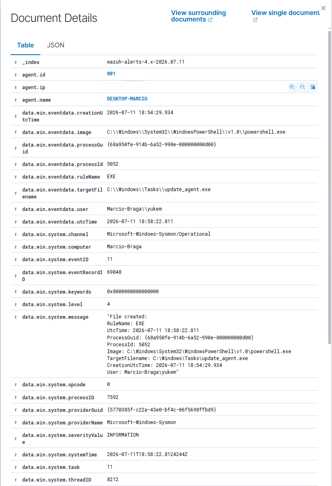
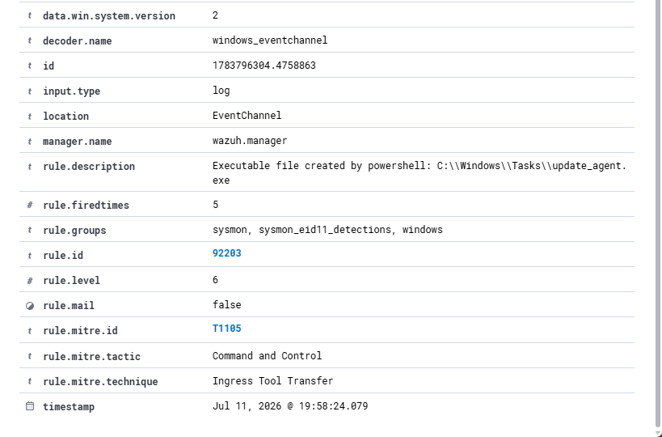

# Case Study 4 – Suspicious File Creation

## Scenario

During routine security monitoring, Wazuh generated an alert indicating that Windows PowerShell created an executable file inside a sensitive Windows directory.

Creating executable files through PowerShell is uncommon during normal administrative activities and may indicate malware deployment, payload staging, or post-exploitation behavior.

The objective of this investigation was to determine whether the detected file creation represented malicious activity or a controlled laboratory simulation.

---

## Alert Summary

| Field | Value |
|--------|-------|
| Timestamp | Jul 11, 2026 @ 19:58:24 |
| Host | DESKTOP-MARCIO |
| User | Marcio-Braga\yukem |
| Event ID | 11 (File Creation) |
| Rule ID | 92203 |
| Rule Description | Executable file created by powershell |
| Severity | 6 |
| MITRE ATT&CK | T1105 – Ingress Tool Transfer |

---

## Initial Evidence

Wazuh detected the creation of an executable file by **Windows PowerShell**.

The generated event identified the following file:

**Process**

```text
powershell.exe
```

**Created File**

```text
C:\Windows\Tasks\update_agent.exe
```

The alert was triggered because PowerShell created an executable file inside the **C:\Windows\Tasks** directory.

This behavior is uncommon during normal Windows administration and is frequently associated with malware deployment or payload staging.

For this reason, Wazuh generated an alert for investigation.

---

# Evidence

## Figure 1 – File Creation Details



*Figure 1 presents the Sysmon File Creation event collected by Wazuh, including the PowerShell process responsible for creating the file, the target filename (`update_agent.exe`), user context, process identifiers, timestamps, and additional forensic artifacts used during the investigation.*

---

## Figure 2 – Wazuh Alert Summary



*Figure 2 presents the Wazuh detection metadata, including the triggered detection rule (Rule ID 92203), severity level, Sysmon Event ID, MITRE ATT&CK mapping, decoder information, and timestamp associated with the generated alert.*

---

## Investigation

The investigation focused on determining whether the executable file creation represented legitimate administrative behavior or potential malware activity.

### Process

```text
C:\Windows\System32\WindowsPowerShell\v1.0\powershell.exe
```

### Created File

```text
C:\Windows\Tasks\update_agent.exe
```

### User

```text
Marcio-Braga\yukem
```

### Event ID

```text
11
```

---

## File Analysis

The investigation confirmed that **Windows PowerShell** created an executable file named **update_agent.exe** inside the **C:\Windows\Tasks** directory.

PowerShell is capable of creating files; however, generating executable (.exe) files is uncommon during normal administrative operations.

Additionally, the **Windows\Tasks** directory has historically been abused by malware families to store payloads and establish persistence.

For these reasons, the activity deserved further investigation.

---

## MITRE ATT&CK Analysis

| Tactic | Technique | ID |
|---------|-----------|----|
| Command and Control | Ingress Tool Transfer | T1105 |

The generated alert was correctly mapped to **MITRE ATT&CK T1105 – Ingress Tool Transfer**, since the observed behavior is consistent with techniques frequently used to introduce malicious files into a compromised system.

---

## Analyst Assessment

The investigation confirmed that the executable file was intentionally created by the legitimate user **Marcio-Braga\yukem** during a controlled SOC laboratory exercise.

Although the behavior resembles techniques commonly used by attackers, no persistence mechanisms, malicious execution, network communications, privilege escalation, or additional indicators of compromise were identified.

The investigation concluded that the activity represented a controlled simulation designed to validate Wazuh detection capabilities.

---

## Analyst Verdict

| Result | Classification |
|----------|---------------|
| ✅ Event Confirmed | File creation successfully detected |
| ✅ True Positive | The event actually occurred |
| ✅ Simulated Malicious Behavior | Generated intentionally during laboratory |
| ❌ Security Incident | Not confirmed |
| ❌ Escalation Required | No |

---

## 🧠 Analyst's Thought Process

> **Why was this alert generated?**
>
> Wazuh detected that PowerShell created an executable file inside a Windows system directory. This behavior is commonly associated with malware deployment and therefore triggered a detection rule.
>
> **What evidence was collected?**
>
> The investigation analyzed the PowerShell process, target filename, execution path, user context, timestamps, process identifiers, detection rule, severity level, and MITRE ATT&CK mapping.
>
> **What was investigated?**
>
> The investigation focused on validating who created the file, where it was created, whether the destination directory was suspicious, and whether additional malicious activity occurred after the file creation.
>
> **What led to the final decision?**
>
> The executable file was intentionally created during a controlled laboratory exercise to simulate suspicious behavior and validate the detection capabilities of Wazuh.
>
> **Final Decision**
>
> The alert was classified as a **Benign True Positive**. Wazuh correctly detected a behavior commonly associated with malware deployment; however, the surrounding context confirmed that the activity was part of a controlled laboratory exercise.

---

## Lessons Learned

Creating executable files through PowerShell is uncommon and should always be investigated.

SOC analysts should validate:

- Which process created the file.
- The destination directory.
- The file extension.
- The user context.
- The execution timeline.
- Additional Sysmon events.
- Potential persistence or execution attempts.

Only after correlating all available evidence can the activity be accurately classified.

---

## Key Takeaway

> **File creation alerts identify suspicious behavior—not necessarily malicious intent.**
>
> The role of a SOC analyst is to investigate who created the file, where it was created, why it was created, and whether the surrounding context indicates legitimate administrative activity or a genuine security incident.

---

## Author

**Marcio Braga**

Cybersecurity Student

SOC Analyst | Blue Team | Wazuh | SIEM | Threat Hunting | Windows Security | AWS Cloud Security (Learning)
