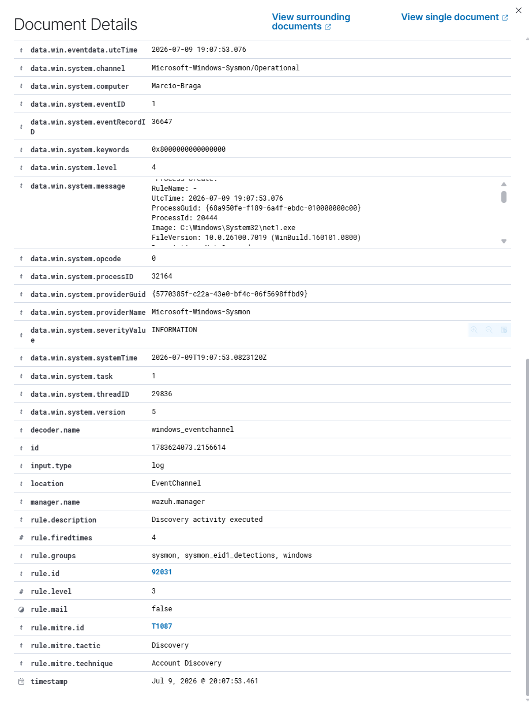
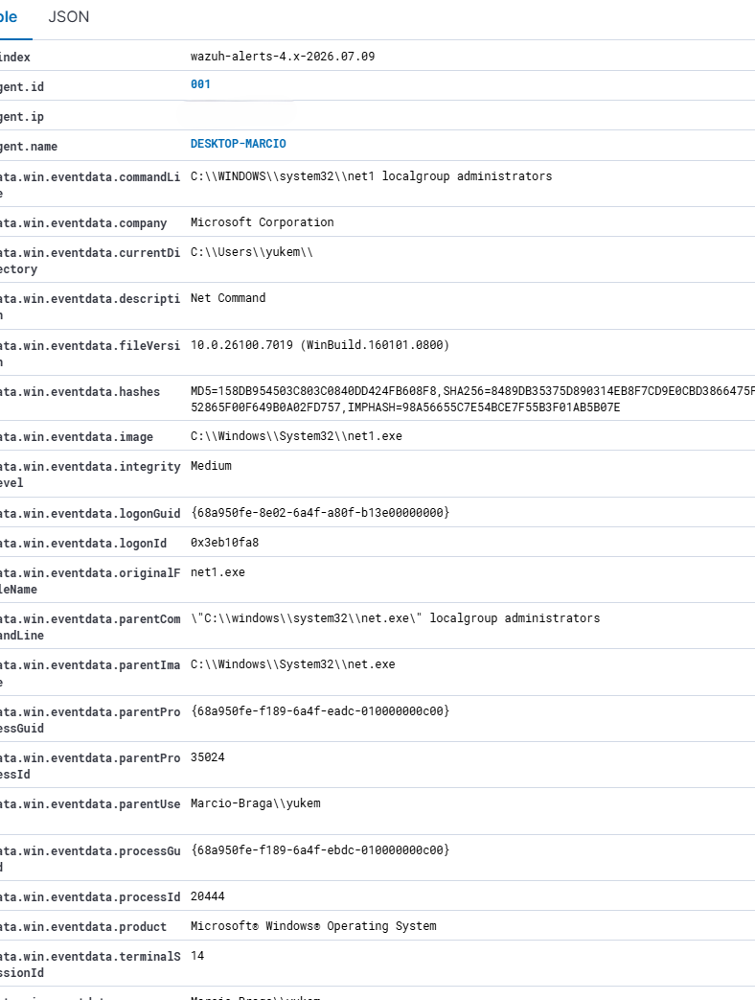

# Case Study 1 – Windows Discovery Activity

## Scenario

During routine security monitoring, Wazuh generated an alert indicating that a Windows Discovery command had been executed on the monitored endpoint.

The objective of this investigation was to determine whether the detected activity represented legitimate administrative behavior or a potential security threat.

---

## Alert Summary

| Field | Value |
|--------|-------|
| Timestamp | Jul 9, 2026 @ 20:07:53 |
| Host | DESKTOP-MARCIO |
| User | Marcio-Braga\yukem |
| Event ID | 1 (Process Creation) |
| Rule ID | 92031 |
| Rule Description | Discovery activity executed |
| Severity | 3 |
| MITRE ATT&CK | T1087 – Account Discovery |

---

## Initial Evidence

Wazuh detected the execution of a Windows Discovery command on the monitored endpoint.

The generated event indicated the creation of the following process:

**Process**

```text
net1.exe
```

**Executed Command**

```cmd
net localgroup administrators
```

This Windows command enumerates all members of the local **Administrators** group.

Although commonly used by system administrators, the same command is frequently executed by threat actors during the **Discovery** phase after compromising a Windows host.

Because of this behavior, Wazuh generated an alert for analyst investigation.

---

# Evidence

## Figure 1 – Process and Event Details



*Figure 1 presents the Sysmon process details collected by Wazuh, including the executed command, process image, parent process, user context, hashes, integrity level, and other technical attributes used during the investigation.*

---

## Figure 2 – Wazuh Alert Summary



*Figure 2 shows the Wazuh detection details, including the triggered rule, severity level, MITRE ATT&CK mapping, event metadata, and timestamp associated with the alert.*

---

## Investigation

The investigation focused on validating the origin of the process and determining whether the detected activity represented legitimate administrative behavior or a potential security incident.

### Process Created

```text
C:\Windows\System32\net1.exe
```

### Parent Process

```text
C:\Windows\System32\net.exe
```

### Executed Command

```cmd
net localgroup administrators
```

### User

```text
Marcio-Braga\yukem
```

### Process Purpose

The command **net localgroup administrators** enumerates all user accounts that belong to the local **Administrators** group.

This command is widely used by Windows administrators for legitimate management tasks.

However, it is also commonly observed during attacker reconnaissance, where adversaries attempt to identify privileged accounts before privilege escalation or lateral movement.

For this reason, security monitoring solutions classify this activity under the **Discovery** tactic.

---

## MITRE ATT&CK Analysis

| Tactic | Technique | ID |
|---------|-----------|----|
| Discovery | Account Discovery | T1087 |

The generated alert was correctly mapped to **MITRE ATT&CK T1087 – Account Discovery**, as the executed command attempts to enumerate privileged local accounts.

---

## Analyst Assessment

The investigation confirmed that the command was intentionally executed by the legitimate user **Marcio-Braga\yukem** during a controlled laboratory exercise.

The parent-child relationship followed the expected Windows execution flow:

```text
net.exe
    │
    └── net1.exe
```

No indicators of:

- Privilege Escalation
- Persistence
- Lateral Movement
- Defense Evasion
- Additional suspicious processes

were identified during the investigation.

Although this command is frequently associated with attacker reconnaissance, the surrounding context demonstrated that the activity was expected and legitimate.

---

## Analyst Verdict

| Result | Classification |
|----------|---------------|
| ✅ Event Confirmed | Process creation successfully detected |
| ✅ True Positive | The event actually occurred |
| ✅ Legitimate Administrative Activity | Command executed intentionally |
| ❌ Security Incident | Not confirmed |
| ❌ Escalation Required | No |

---

## 🧠 Analyst's Thought Process

> **Why was this alert generated?**
>
> Wazuh detected the execution of the command `net localgroup administrators`, which is commonly associated with the **Discovery** phase of the MITRE ATT&CK framework. Threat actors frequently execute this command to enumerate privileged local accounts after gaining initial access.
>
> **What evidence was collected?**
>
> The investigation analyzed the executed command, process image, parent process, user context, command line, timestamps, Sysmon Event ID, detection rule, severity level, and MITRE ATT&CK mapping.
>
> **What was investigated?**
>
> The parent-child process relationship (`net.exe → net1.exe`), execution context, user identity, and command purpose were reviewed to determine whether the activity represented normal system administration or attacker reconnaissance.
>
> **What led to the final decision?**
>
> The command was intentionally executed by the legitimate user **Marcio-Braga\yukem** during a controlled SOC laboratory exercise. No additional suspicious behavior or indicators of compromise were observed before or after the event.
>
> **Final Decision**
>
> The alert was classified as a **Benign True Positive**. Wazuh correctly detected a behavior associated with attacker reconnaissance, while the surrounding context confirmed that the activity was legitimate.

---

## Lessons Learned

This investigation demonstrates that not every SIEM alert represents malicious activity.

Administrative commands such as **net localgroup administrators** are legitimate Windows utilities but are also commonly abused during adversary reconnaissance.

A SOC analyst should never base a conclusion solely on the triggered detection rule.

Instead, the investigation should always correlate:

- User context
- Parent process
- Process image
- Command line
- Process purpose
- MITRE ATT&CK mapping
- Overall execution context

Only after correlating all available evidence can an analyst accurately determine whether escalation is required.

---

## Key Takeaway

> **A SIEM detects behaviors—not intentions.**
>
> The role of a SOC analyst is to investigate the surrounding context, correlate multiple sources of evidence, and determine whether the observed behavior represents legitimate administrative activity or an actual security incident.
