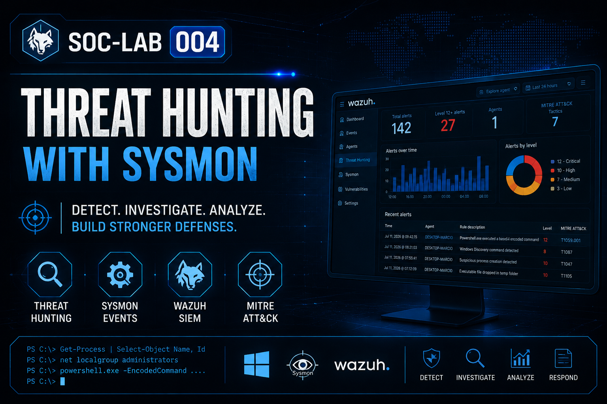

  

# SOC-LAB-004 – Threat Hunting with Sysmon

## Overview

This laboratory focuses on **Threat Hunting** using Microsoft Sysmon and Wazuh SIEM.

Unlike traditional alert monitoring, the objective of this lab is to investigate Windows events, understand why alerts were generated, validate the evidence, and determine whether the observed activity represents legitimate behavior or a potential security incident.

Each investigation follows the methodology used by SOC analysts, including evidence collection, MITRE ATT&CK mapping, analyst assessment, and final verdict.

---

## Objectives

- Perform Threat Hunting using Sysmon telemetry
- Investigate Windows process creation events
- Analyze PowerShell activity
- Investigate suspicious file creation
- Understand MITRE ATT&CK mappings
- Practice evidence-based security investigations
- Improve SOC analyst decision-making

---

# Lab Environment

| Component | Technology |
|-----------|------------|
| Operating System | Windows 11 |
| Endpoint Telemetry | Microsoft Sysmon |
| SIEM | Wazuh |
| Log Collection | Wazuh Agent |
| Detection Engine | Wazuh Rules |
| Threat Framework | MITRE ATT&CK |

---

# Investigation Methodology

Each case study follows the same investigation workflow:

1. Alert Detection
2. Initial Evidence Collection
3. Process Analysis
4. Parent Process Analysis
5. MITRE ATT&CK Mapping
6. Analyst Assessment
7. Final Verdict
8. Lessons Learned

---

# Case Studies

## Case Study 1 – Windows Discovery Activity

Investigation of a Windows Discovery command executed using **net localgroup administrators**, mapped to **MITRE ATT&CK T1087 – Account Discovery**.

➡️ **Open Case Study**

[Case-01-Windows-Discovery](Case-01-Windows-Discovery)

---

## Case Study 2 – Encoded PowerShell Execution

Investigation of a Base64-encoded PowerShell command executed using **-EncodedCommand**, mapped to **MITRE ATT&CK T1059.001 – PowerShell**.

➡️ **Open Case Study**

[Case-02-Encoded-PowerShell](Case-02-Encoded-PowerShell)

---

## Case Study 3 – Suspicious Process Creation

Investigation of a suspicious Windows process creation event and validation of execution context.

➡️ **Open Case Study**

[Case-03-Process-Creation](Case-03-Process-Creation)

---

## Case Study 4 – Suspicious File Creation

Investigation of file creation activity detected by Sysmon and analyzed by Wazuh.

➡️ **Open Case Study**

[Case-04-File-Creation](Case-04-File-Creation)

---

# Skills Demonstrated

- Threat Hunting
- Security Monitoring
- SOC Investigation
- Windows Event Analysis
- Microsoft Sysmon
- Wazuh SIEM
- Process Analysis
- PowerShell Investigation
- MITRE ATT&CK Mapping
- Incident Triage
- Windows Forensics
- Security Event Correlation

---

# Key Takeaways

This laboratory demonstrates how Threat Hunting goes beyond simply reviewing alerts.

Every alert was investigated by collecting evidence, analyzing process relationships, validating user context, mapping the activity to the MITRE ATT&CK framework, and determining whether the behavior represented legitimate administration or malicious activity.

The objective is to replicate the analytical workflow performed by SOC analysts during real-world security investigations.

---

## Author

**Marcio Braga**

Cybersecurity Student

SOC Analyst | Blue Team | Wazuh | SIEM | Windows Security | AWS Cloud Security (Learning)
