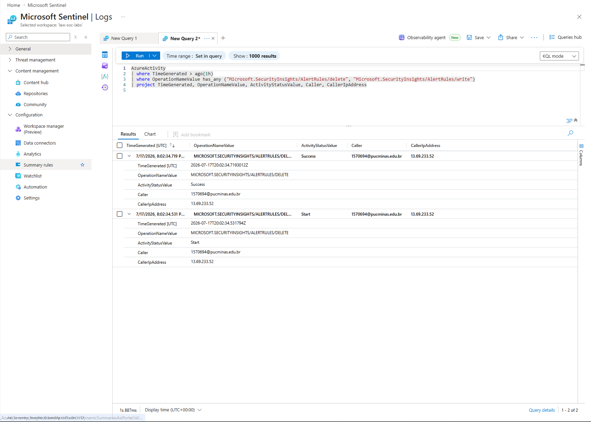

# LAB-006 – Monitoring Microsoft Sentinel Administrative Activities with Azure Activity Logs

## Overview

This lab demonstrates how to use Azure Activity Logs together with Kusto Query Language (KQL) to monitor administrative operations performed within Microsoft Sentinel.

A hunting query was developed to identify administrative changes made to Microsoft Sentinel Analytics Rules, including rule creation, modification, and deletion operations recorded within Azure Activity Logs.

Monitoring these activities enables security teams to detect unauthorized or unexpected changes that could impact the effectiveness of the SIEM environment.

This implementation represents a common operational scenario performed by SOC Analysts and Cloud Security Engineers responsible for protecting enterprise security monitoring platforms.

---

# Objectives

- Query Azure Activity Logs
- Monitor Microsoft Sentinel administrative operations
- Detect Analytics Rule creation, modification, and deletion events
- Execute KQL queries
- Validate Azure Activity events
- Analyze administrative activities
- Perform threat hunting using Azure Activity Logs

---

# Technologies Used

- Microsoft Azure
- Microsoft Sentinel
- Azure Activity Logs
- Azure Monitor
- Azure Log Analytics Workspace
- Kusto Query Language (KQL)

---

# Environment

| Component | Value |
|------------|-------|
| Workspace | LAW-SOC-LABS |
| SIEM Platform | Microsoft Sentinel |
| Data Source | Azure Activity Logs |
| Azure Region | Sweden Central |
| Query Language | Kusto Query Language (KQL) |

---

# Architecture

```text
Microsoft Sentinel
        │
        ▼
Analytics Rules
        │
        ▼
Azure Activity Logs
        │
        ▼
Azure Log Analytics Workspace
        │
        ▼
Kusto Query Language (KQL)
        │
        ▼
Administrative Activity Monitoring
```

---

# Security Relevance

Administrative changes to Microsoft Sentinel Analytics Rules can directly impact an organization's ability to detect malicious activity.

Monitoring write and delete operations helps security teams identify unauthorized modifications, maintain governance over detection rules, and preserve the integrity of the SIEM environment.

---

# Implementation

## Step 1 – Access Microsoft Sentinel Logs

Microsoft Sentinel was used to query Azure Activity Logs stored in the Azure Log Analytics Workspace.

---

## Step 2 – Develop the Hunting Query

A KQL query was created to filter Azure Activity Logs for administrative operations related to Microsoft Sentinel Analytics Rules.

The query monitors the following operations:

- Microsoft.SecurityInsights/AlertRules/write
- Microsoft.SecurityInsights/AlertRules/delete

---

## Step 3 – Execute the Query

The hunting query was executed against the AzureActivity table to identify administrative events.

Relevant information returned includes:

- Timestamp
- Operation Name
- Operation Status
- User Account
- Source IP Address

---

## Step 4 – Validate Administrative Activities

The query successfully identified administrative operations performed against Microsoft Sentinel Analytics Rules, confirming that Azure Activity Logs can be used to monitor changes within the SIEM environment.

---

# Validation

## Monitoring Microsoft Sentinel Analytics Rules

### Query

```kql
AzureActivity
| where TimeGenerated > ago(1h)
| where OperationNameValue has_any (
    "Microsoft.SecurityInsights/AlertRules/delete",
    "Microsoft.SecurityInsights/AlertRules/write"
)
| project
    TimeGenerated,
    OperationNameValue,
    ActivityStatusValue,
    Caller,
    CallerIpAddress
```

### Result

The query successfully returned administrative operations related to Microsoft Sentinel Analytics Rules.

The collected information included:

- Operation timestamp
- Administrative action performed
- Operation status
- User account responsible
- Source IP address

The returned results confirmed successful detection of Analytics Rule administrative activities, including the execution status, initiating user, and originating IP address.

### Evidence

<p align="center">
  
</p>

---

# KQL Query Used

### Monitor Sentinel Analytics Rule Changes

```kql
AzureActivity
| where TimeGenerated > ago(1h)
| where OperationNameValue has_any (
    "Microsoft.SecurityInsights/AlertRules/delete",
    "Microsoft.SecurityInsights/AlertRules/write"
)
| project
    TimeGenerated,
    OperationNameValue,
    ActivityStatusValue,
    Caller,
    CallerIpAddress
```

---

# Skills Demonstrated

- Microsoft Sentinel
- Azure Activity Logs
- Azure Monitor
- Azure Log Analytics
- Kusto Query Language (KQL)
- Azure Administration
- Threat Hunting
- Administrative Activity Monitoring
- Cloud Security Monitoring
- Security Investigation
- SOC Operations

---

# Key Learning Outcomes

This lab demonstrated how Azure Activity Logs can be used to monitor administrative operations performed within Microsoft Sentinel.

By leveraging Kusto Query Language (KQL), it was possible to identify changes made to Analytics Rules, including write and delete operations performed within the SIEM environment.

In addition to Windows Security Event monitoring, Azure Activity Logs provide visibility into management-plane operations, allowing security teams to audit changes performed against cloud security resources.

Monitoring these activities provides valuable visibility into administrative actions that could affect the effectiveness of security monitoring and incident detection.

These tasks closely resemble operational activities performed by SOC Analysts and Cloud Security Engineers responsible for maintaining secure and well-governed Microsoft Sentinel environments.

---

# References

- Microsoft Learn – Azure Activity Log
- Microsoft Learn – Microsoft Sentinel
- Microsoft Learn – Azure Monitor
- Microsoft Learn – Kusto Query Language (KQL)

---

# Conclusion

This lab demonstrated how Azure Activity Logs can be leveraged to monitor administrative operations performed within Microsoft Sentinel.

By using Kusto Query Language (KQL), it was possible to identify Analytics Rule management activities, including write and delete operations, together with the responsible user account and source IP address.

Monitoring these events strengthens governance, auditing, and change tracking while helping security teams detect potentially unauthorized modifications to critical detection components.

This type of monitoring represents a common operational task performed by SOC Analysts and Cloud Security Engineers responsible for protecting enterprise SIEM environments.
