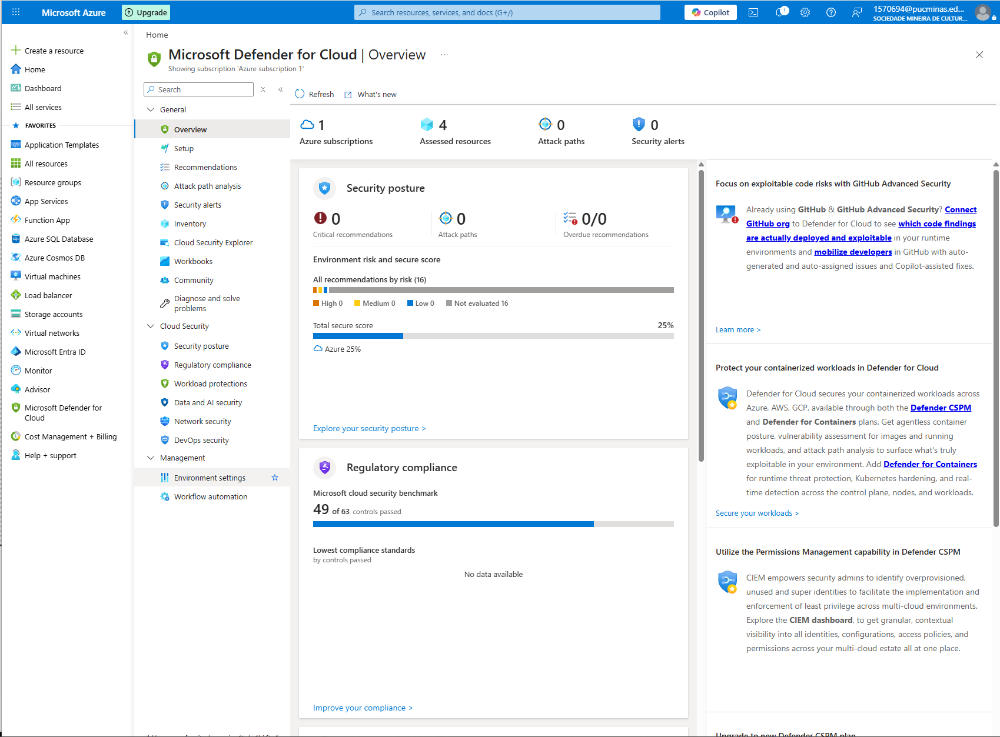
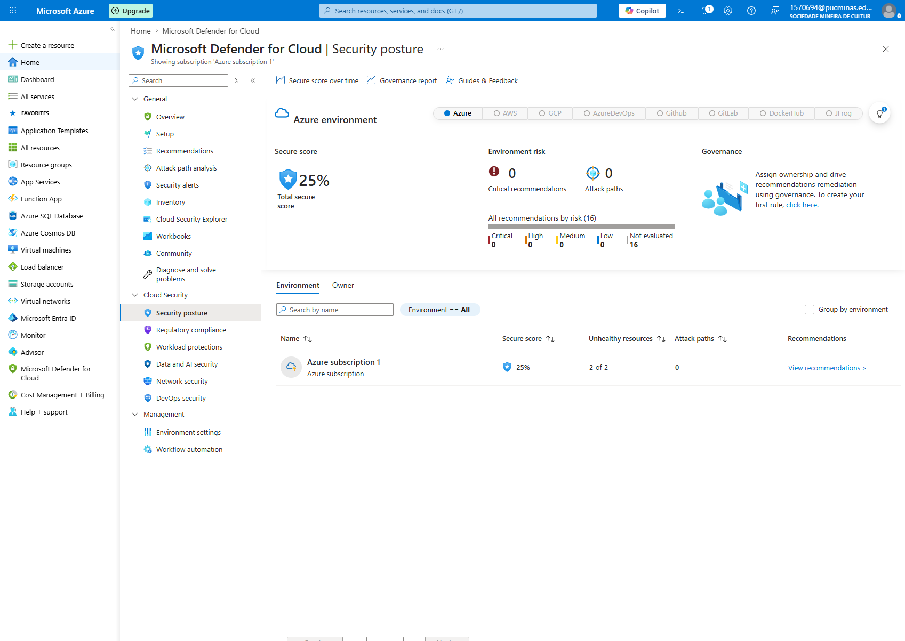
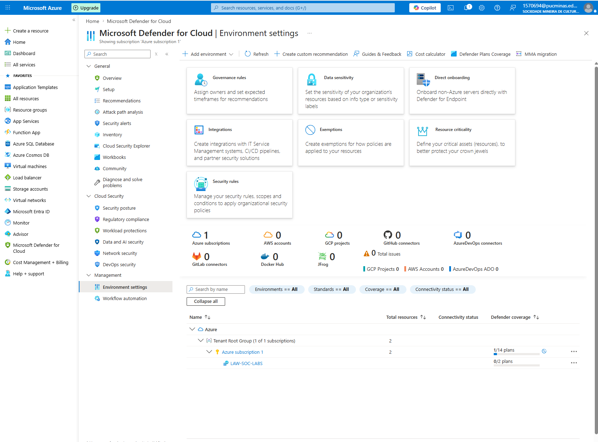
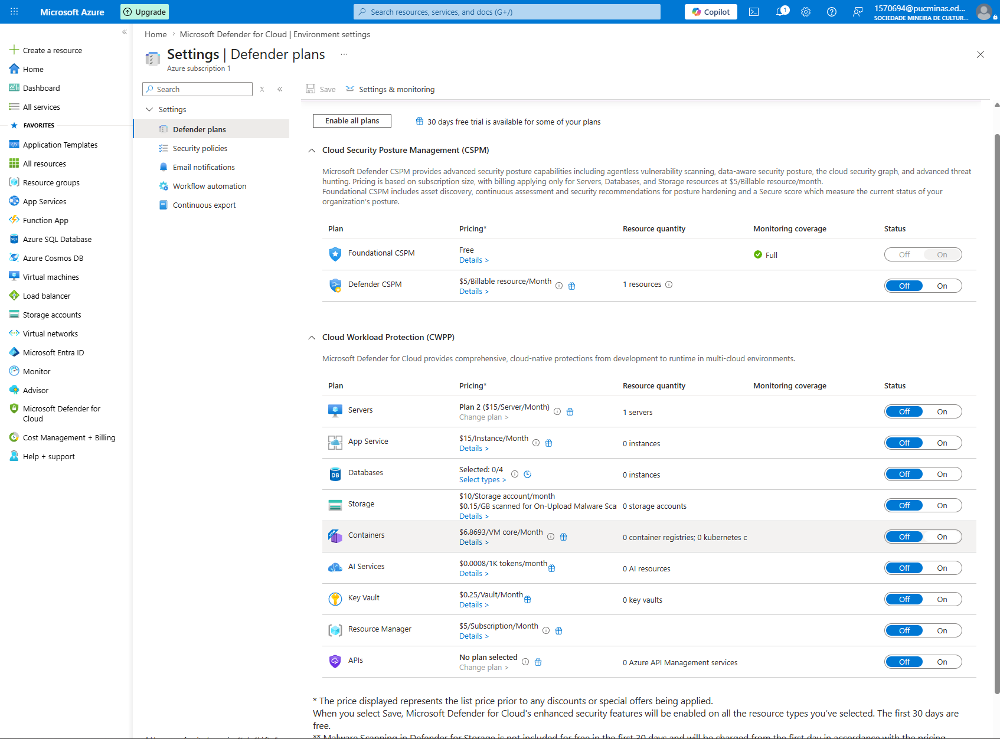
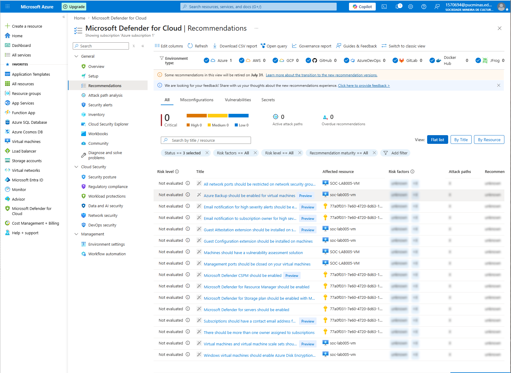
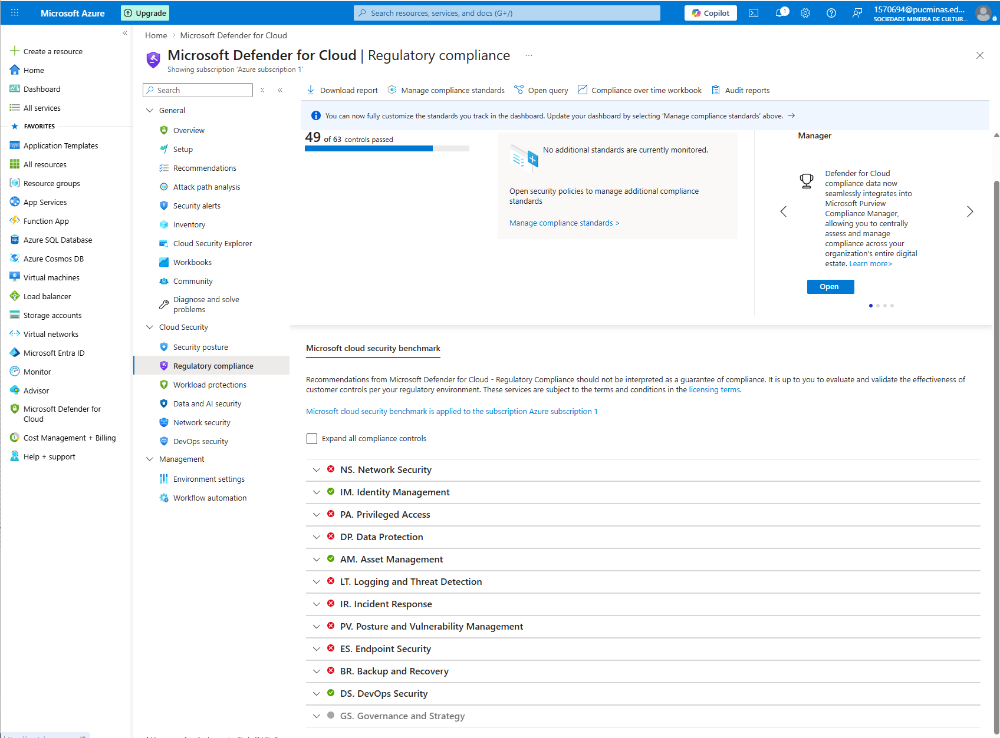
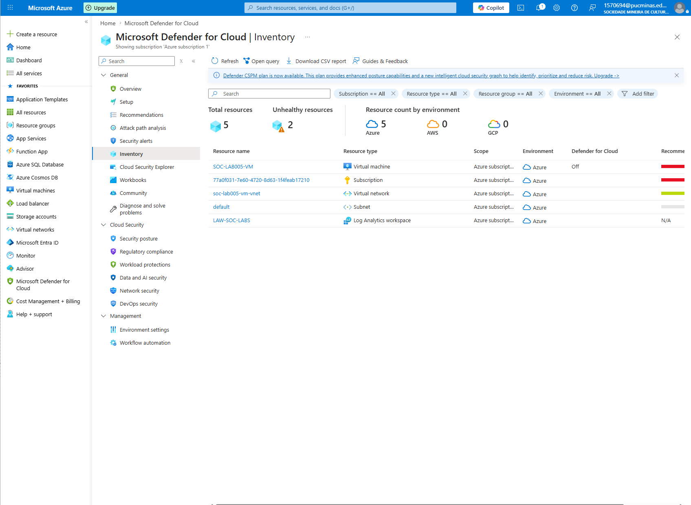

# LAB-008 – Microsoft Defender for Cloud: Secure Score & Recommendations

## 🎯 Objective

This lab aimed to explore Microsoft Defender for Cloud and understand how it assesses the security posture of Azure resources. The lab focused on Secure Score analysis, security recommendations, regulatory compliance, Defender Plans, and resource inventory.

---

# 🏗️ Lab Environment

| Component | Configuration |
|------------|---------------|
| Cloud Platform | Microsoft Azure |
| Security Solution | Microsoft Defender for Cloud |
| Subscription | Azure Subscription 1 |
| Virtual Machine | SOC-LAB005-VM |
| Log Analytics Workspace | LAW-SOC-LABS |

---

# 🛠️ Technologies Used

- Microsoft Azure
- Microsoft Defender for Cloud
- Secure Score
- Security Posture
- Security Recommendations
- Regulatory Compliance
- Defender Plans
- Azure Resource Inventory

---

# 📷 Lab Evidence

## 1. Microsoft Defender for Cloud Overview

The Overview dashboard provides a centralized view of the Azure security posture, displaying assessed resources, Secure Score, attack paths, security alerts, and compliance status.

**Current Environment**

- Azure Subscriptions: **1**
- Assessed Resources: **4**
- Attack Paths: **0**
- Security Alerts: **0**

---

## 2. Security Posture (Secure Score)

The Security Posture dashboard evaluates the overall security posture of the Azure environment.

**Current Secure Score**

- Secure Score: **25%**
- Critical Recommendations: **0**
- Attack Paths: **0**
- Recommendations Identified: **16**

This baseline will be used to measure future security improvements throughout the Azure Security Labs.

---

## 3. Environment Settings

Environment Settings centralizes Defender for Cloud configuration for the Azure subscription.

From this section it is possible to manage:

- Governance Rules
- Data Sensitivity
- Integrations
- Security Rules
- Resource Criticality
- Direct Onboarding

---

## 4. Defender Plans

Microsoft Defender for Cloud separates its capabilities into two categories:

### Cloud Security Posture Management (CSPM)

- ✅ Foundational CSPM (Free)
- ❌ Defender CSPM (Disabled)

### Cloud Workload Protection (CWPP)

The following protection plans remained disabled during this lab:

- Servers
- App Service
- Databases
- Storage
- Containers
- AI Services
- Key Vault
- Resource Manager
- APIs

Premium plans were intentionally left disabled to keep the laboratory within the available Azure budget.

---

## 5. Security Recommendations

Microsoft Defender for Cloud automatically generated several security recommendations for the environment.

Examples identified during this assessment include:

- Restrict network security group ports
- Enable Azure Backup for Virtual Machines
- Configure Security Contacts
- Install Guest Configuration Extension
- Install Vulnerability Assessment Solution
- Close Management Ports
- Enable Azure Disk Encryption

These recommendations will be implemented during future Azure Security Labs.

---

## 6. Regulatory Compliance

Microsoft Defender for Cloud evaluates Azure resources against security frameworks.

Current assessment:

**Microsoft Cloud Security Benchmark**

**Compliance Status**

- 49 of 63 controls passed

This compliance baseline will be used to measure future improvements after implementing additional security controls.

---

## 7. Resource Inventory

The Inventory dashboard automatically discovered all Azure resources currently deployed in the subscription.

Resources identified:

- SOC-LAB005-VM
- LAW-SOC-LABS
- Virtual Network
- Subnet
- Azure Subscription

This inventory enables Microsoft Defender for Cloud to continuously monitor the security posture of each resource.

---

# 🔍 Key Findings

- Microsoft Defender for Cloud successfully assessed the Azure environment.
- Initial Secure Score established at **25%**.
- Sixteen security recommendations were identified.
- Microsoft Cloud Security Benchmark baseline established.
- Azure resources were automatically inventoried.
- Foundational CSPM enabled using the free tier.
- Premium Defender Plans remained disabled.

---

# 🎓 Skills Demonstrated

- Microsoft Defender for Cloud
- Cloud Security Posture Assessment
- Secure Score Analysis
- Security Recommendations
- Regulatory Compliance
- Azure Resource Inventory
- Cloud Security Governance

---

# 📚 Lessons Learned

During this lab, I learned how Microsoft Defender for Cloud evaluates Azure resources, calculates the Secure Score, identifies security recommendations, and measures compliance against Microsoft's security benchmark. I also explored Defender Plans and understood the distinction between free posture management capabilities and premium workload protection features.

---

# 🚀 Next Lab

## LAB-009 – Microsoft Sentinel: Threat Detection & Analytics Rules

The next lab will focus on deploying Microsoft Sentinel, connecting the Log Analytics Workspace, configuring data connectors, exploring Analytics Rules, and preparing the environment for threat detection and incident response.
